# YC 项目

## 1. 获取 YC 项目原始信息

> 通过爬虫等方式，获取 YC S24 的项目信息

### 1.1 获取总项目列表

#### 整体思路分析：

1. 目标网站和获取目标
   1. https://www.ycombinator.com/companies?batch=s24
   2. https://www.ycombinator.com/launches?batch=S2024
   3. 获取所有标签为 S24 的项目名字和项目的详情链接
2. 实现方案（多种实现方案）
   1. 使用 selenium 对目标网站模拟访问

      1. 访问模拟滚动行为，等待完全加载完成后，保存所有渲染后的 html

         1. 这步也可以手动滚动后，对控制台编写脚本，保存渲染后的 html 得到，更加简单，并且避免代理问题。
      2. 使用 BeautifulSoup 对保存后的 html 进行解析
      3. 根据网站开发者工具，找到对应的标签，然后批量获取后保存

         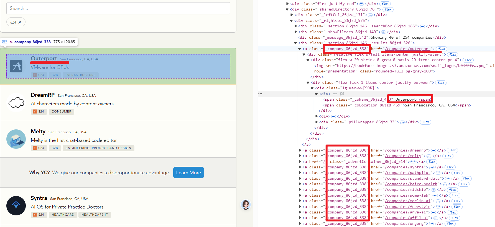
      4. 方案优劣

         1. 优势：所见即所得，上手简单
         2. 劣势：得到的数据都是渲染后的，难以看到一些传输的“隐性数据”，内存占用会较大
   2. 额外方案一：使用网站的开发者工具的控制台，在全部渲染完之后，直接编写 js 脚本，对内容进行提取。（提取思路和前面是一样的，只是语言不同）

      ```js
      // 参考代码
      function downloadCSV(csvContent, filename) {
          const blob = new Blob([csvContent], { type: 'text/csv;charset=utf-8;' });
          const link = document.createElement("a");
          const url = URL.createObjectURL(blob);
          link.setAttribute("href", url);
          link.setAttribute("download", filename);
          document.body.appendChild(link);
          link.click();
          document.body.removeChild(link);
      }

      // Function to extract data and convert to CSV format
      function extractLinksAndNamesToCSV() {
          const rows = [];

          // Get all 'a' tags with class '_company_86jzd_338'
          const links = document.querySelectorAll('a._company_86jzd_338');

          links.forEach(link => {
              const url = link.getAttribute('href');  // Get the href of the <a> tag
              const nameElement = link.querySelector('span._coName_86jzd_453');  // Get the span with class '_coName_86jzd_453'
              const name = nameElement ? nameElement.innerText : '';  // Get the text inside the span
              rows.push([url, name]);  // Add the data to the rows
          });

          // Create CSV content
          let csvContent = "URL,Company Name\n";  // CSV header
          rows.forEach(row => {
              csvContent += row.join(",") + "\n";  // Append each row as a line in the CSV
          });

          // Trigger the download
          downloadCSV(csvContent, 'companies.csv');
      }

      // Run the function
      extractLinksAndNamesToCSV();
      ```

      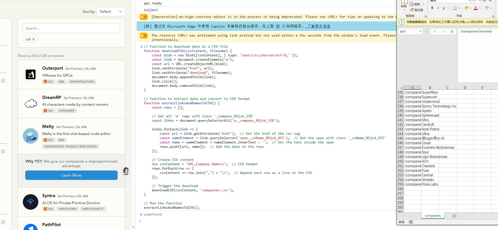
   3. 额外方案二：通过中间人代理/使用开发者工具，找到请求接口，直接获取传输到前端的数据。

      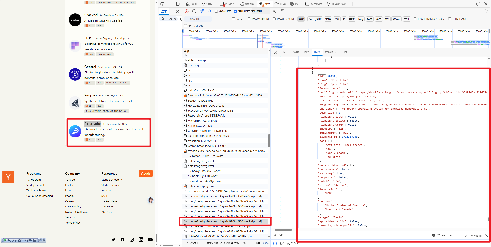

#### 补充说明：

1. 对于原方案的一点补充
   1. 在使用 Selenium 对目标网站访问时，需要主动设置 Proxy。
   2. 由于这部分过程的 Selenium 目的为获取完整滚动渲染后的 html，因此可以人工在浏览器中加载到网页末端，然后使用 js 脚本保存 html，这样可以避免在代码中对 Selenium 的操作，避免代理设置。

      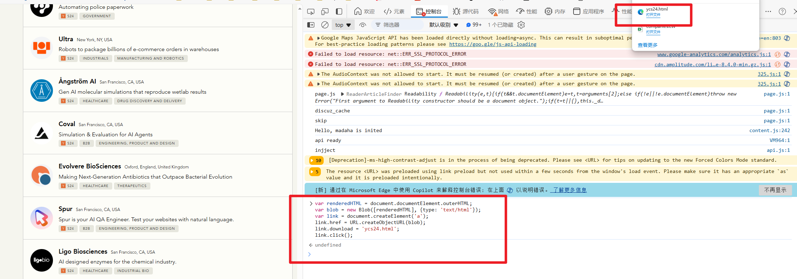

      ```js
      // 参考代码
      var renderedHTML = document.documentElement.outerHTML;
      var blob = new Blob([renderedHTML], {type: 'text/html'});
      var link = document.createElement('a');
      link.href = URL.createObjectURL(blob);
      link.download = 'ycs24.html';
      link.click();
      ```

### 1.2 获取单个项目的数据

#### 整体思路分析：

1. 目标网站和获取目标：

   1. 每个项目的详细介绍链接
   2. 项目的详细信息：介绍文章+项目名片信息+创始人名片信息
2. 实现方案：

   1. 与获取总项目列表差不多，但由于列表存在 200+个项目，因此全人工是不现实的，需要尽可能全自动化
   2. 使用 Selenium 模拟访问（与获取项目列表的过程一致）

      1. 模拟滚动到底，保证全部渲染
      2. 使用 BeautifulSoup 对保存后的 html 进行解析
      3. 根据网站开发者工具，找到对应的标签，然后批量获取后保存

         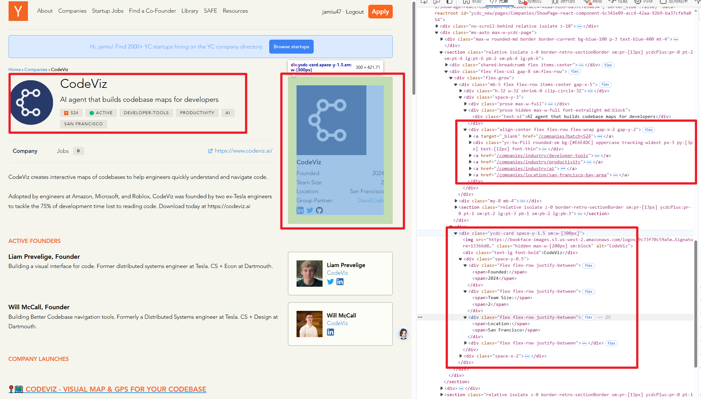
   3. 额外方案：通过中间人代理/使用开发者工具等方式找到请求接口，而后批量请求，获得数据。

#### 补充说明：

1. 对原方案的一点补充
   1. 因为每一个项目的文章内容格式都不相同，因此批量获取存在一定难度，可以考虑跳过，在下一部分，借助 jina-ai/reader 完成。
   2. 同样需要设置 Proxy
   3. 部分内容加载需要进行一定时间的等待
   4. 可以设置多线程加快速度以及代理池
   5. 频率过高会出现被拒绝的情况，需要记录 ERROR 并后续重试

## 2. 数据清理和信息抽取（利用 LLM）

> 核心目标：借助 LLM 的信息抽取能力，对爬取下来的文章，抽取出项目对应的背景/问题（行业通点）以及他们的解决方案，并且对整个项目进行总结。

### 1. 优化给 LLM 的输入

这部分是可选的，并非必做，其源于前一步对文章主体爬取困难

主要借助项目 https://github.com/jina-ai/reader

该项目可以将复杂的 html 网页转化为 LLM 易读的 markdown 格式，并且只保留主要部分。

使用方式有三种姿势：

1. 本地使用这个库，借助其中编写的规则，对 html 进行处理和转化

   1. 本地化操作，可以直接对保存好的 html 进行处理，可手动修改规则更好适配
   2. 对于本地化部署，可以考虑下面这两个项目
      1. https://github.com/intergalacticalvariable/reader
      2. https://github.com/hargup/reader
2. （推荐）借助他们的免费服务，对待访问的完整加前缀 `https://r.jina.ai/`，比如对于https://www.ycombinator.com/companies/codeviz，只需要访问https://r.jina.ai/https://www.ycombinator.com/companies/codeviz即可。好用且方便，大部分情况都可以满足

   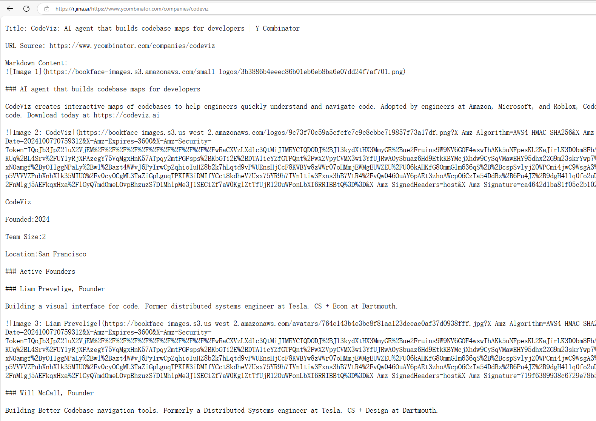
3. jina.ai 考虑使用 LLM 进行端到端处理，开源了两个小模型，用 LLM 来优化 LLM 输入，可以尝试使用

   1. https://huggingface.co/jinaai/reader-lm-0.5b
   2. https://huggingface.co/jinaai/reader-lm-1.5b

   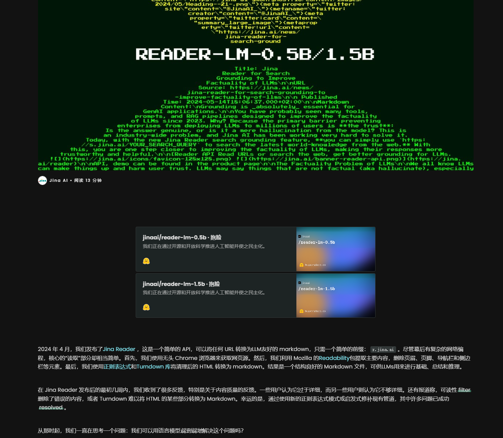

### 2. 用 LLM 进行信息抽取

这一步的整体思路非常直接，用提示词的方式，让大语言模型格式化输出，总结、问题痛点、解决方案。

但实际过程中出于大语言模型的不稳定性，提示词和结构化输出可以有很多优化方案。

1. 提示词的优化，用一定的结构和分割，可以有效的提升输出质量

   ```
   <task>
   {任务}
   </task>
   <rule>
   {输出规则}
   <rule>
   <article>
   {文章内容}
   </article>
   ```
2. 对于结构化输出

   1. 来自一些实验中的结论https://arxiv.org/abs/2408.02442
      1. 让 LLM 严格输出 json 格式可能会降低性能
      2. 不同的大模型偏好的格式不同
   2. 解决方案
   3. 提示词控制，用提示词的方式限制 llm 输出。（可用，但属于几乎最差的方案，推理性能降低，并且还不稳定）
   4. 对于不同大模型，选择更偏好的结构化输出格式，从而尽可能减少的降低
   5. 对于一些本地部署的大模型，可以通过添加一些特定的 embedding 模型，让 LLM 严格输出。
   6. 一些大模型的 API 提供有格式化输出的选项。
   7. 先让大模型自由输出，后用稳定严格生成的小模型进行格式转化。
   8. 使用一些库或框架进行控制，比如 pydantic。

## 3. 制作海报

> 基于已有的 YC 项目信息，制作图片海报。
>
> 使用代码批量制作海报方案很多，比如 fastposter，但这些方案不容易进行较好的自适应布局，因此使用编写 html，渲染后截图保存的形式更为优雅。同时借助一些插件，转化设计稿至前端代码，可以极大加速编写流程。

### 1. 制作自适应模板

具体方案：

1. 使用 mastergo/figma 制作原型模板

   1. 注意事项：在制作时，尽可能采用容器内自动布局编排的方式，从而实现自适应布局，同时为了后续 html 渲染截图，可以控制宽的分辨率固定，高自适应
   2. 参考如下文件

      1. https://mastergo.com/goto/DSUMXlWq?page_id=M&file=134481327511593

         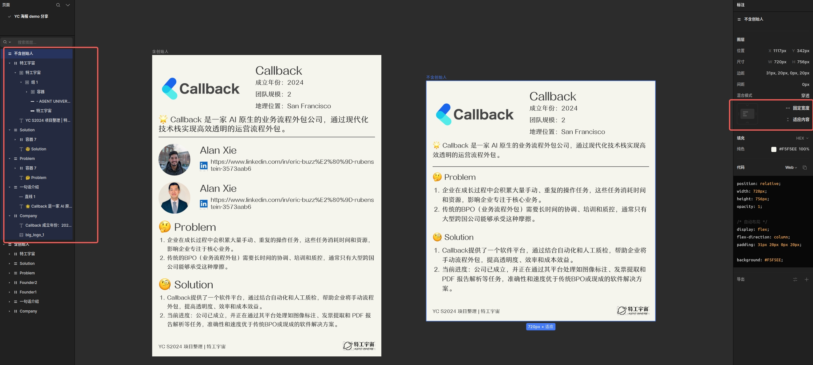
2. 借助 `网易海报 D2C 插件` 实现快速的 UI 设计稿向前端代码的转化

   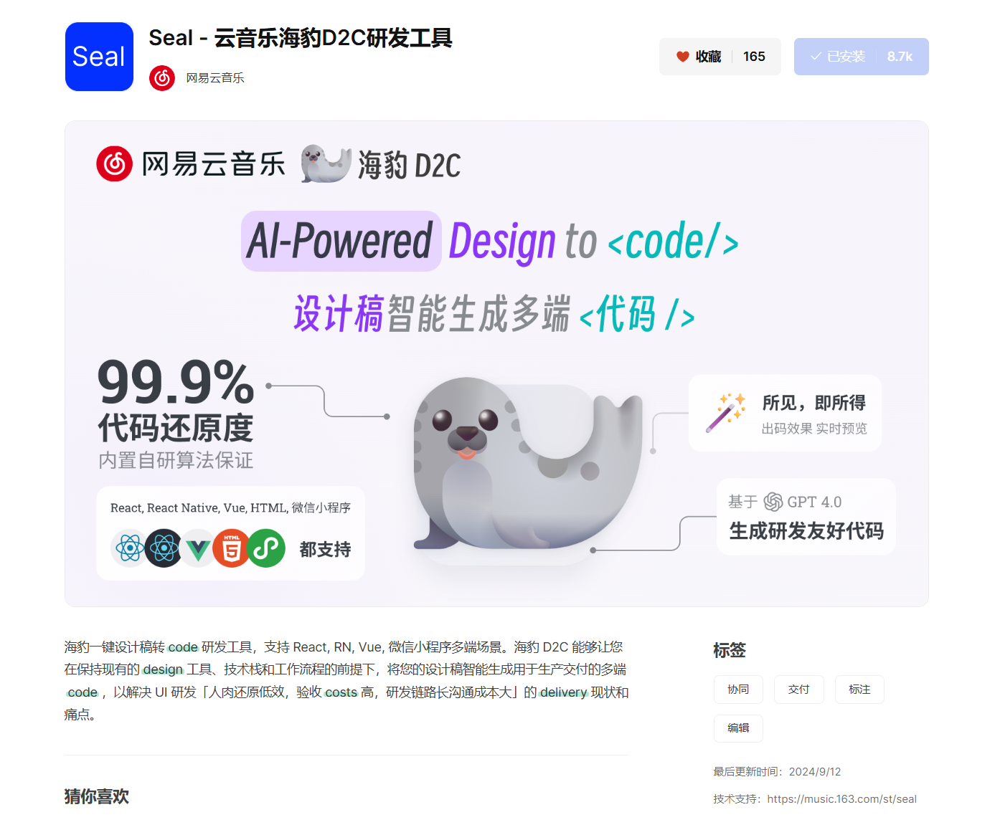

   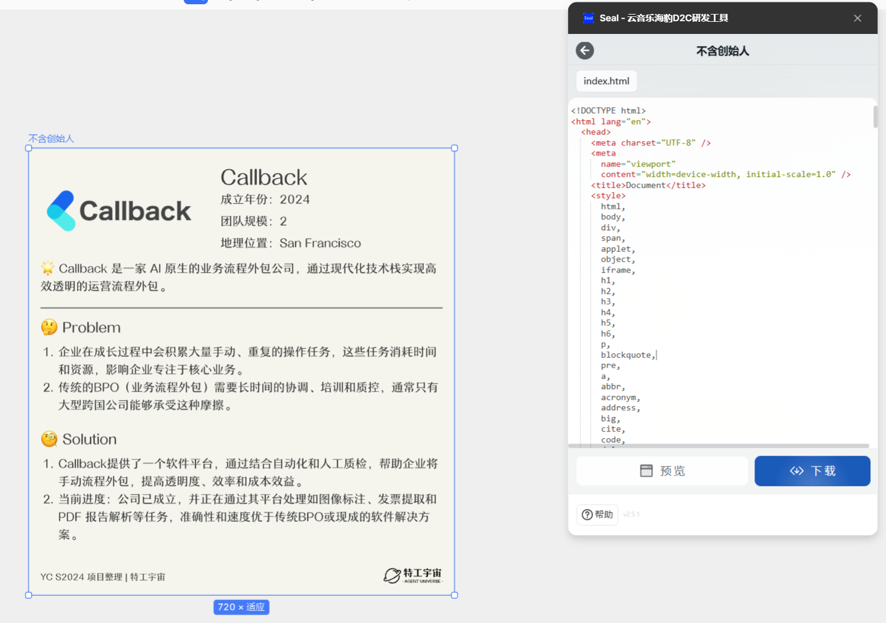
3. 打开网页进行预览

   1. 使用设备仿真可以查看固定分辨率下的状态（右键，检查，切换设备仿真，设定分辨率）

      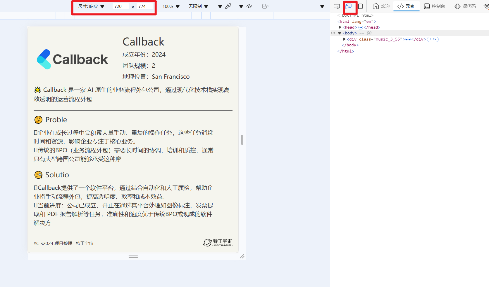
4. 部分转化可能存在一定问题，需要进行简单的手动修改，里面的一些图片链接为临时链接，需要转化为本地资源。

   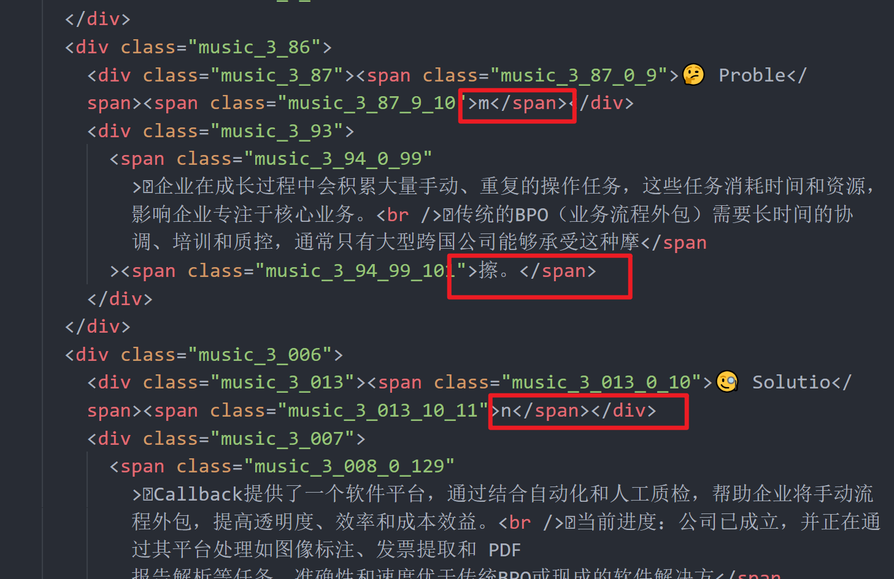
5. 字体资源需要自行添加。

### 2. 批量信息插入并渲染出图

1. 编写代码，批量读取之前保存的信息，对 html 中的部分信息进行批量替换
2. 使用 puppeteer 库，编写 js 代码对 html 进行渲染，然后保存为图片

```js
// 参考代码
const puppeteer = require('puppeteer');
const fs = require('fs');
const path = require('path');

(async () => {
    const browser = await puppeteer.launch();
    const page = await browser.newPage();

    const outputDir = 'screenshots';
    if (!fs.existsSync(outputDir)) {
        fs.mkdirSync(outputDir);
    }

    const htmlFiles = fs.readdirSync('html_output').filter(file => file.endsWith('.html'));

    for (const htmlFile of htmlFiles) {
        const filePath = path.join(__dirname, 'html_output', htmlFile);
      
        await page.goto(`file://${filePath}`, { waitUntil: 'networkidle2' });

        // 设置宽度为720，自动计算高度
        await page.setViewport({ width: 720, height: 0 }); // height=0以计算自适应高度
        const bodyHandle = await page.$('body');
        const { height } = await bodyHandle.boundingBox();
        await bodyHandle.dispose();

        // 重新设置viewport高度
        await page.setViewport({ width: 720, height: Math.ceil(height),deviceScaleFactor: 3});

        // 截图并保存
        const screenshotPath = path.join(outputDir, `${path.parse(htmlFile).name}.png`);
        await page.screenshot({ path: screenshotPath, fullPage: true });
    }

    await browser.close();
})();
```

注意事项：

```js
await page.setViewport({ width: 720, height: Math.ceil(height),deviceScaleFactor: 3});
```

这段代码中的 deviceScaleFactor 默认为 1，可能会导致图片不够清晰，可以设置大些。
